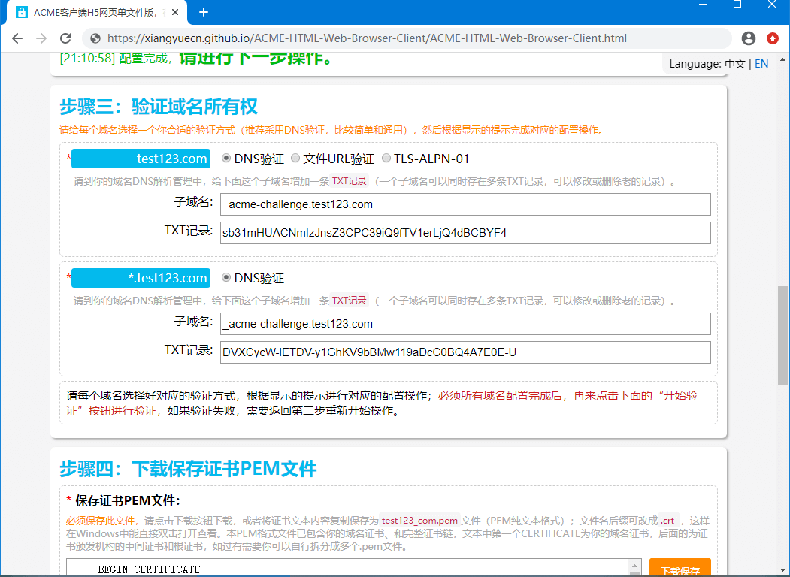
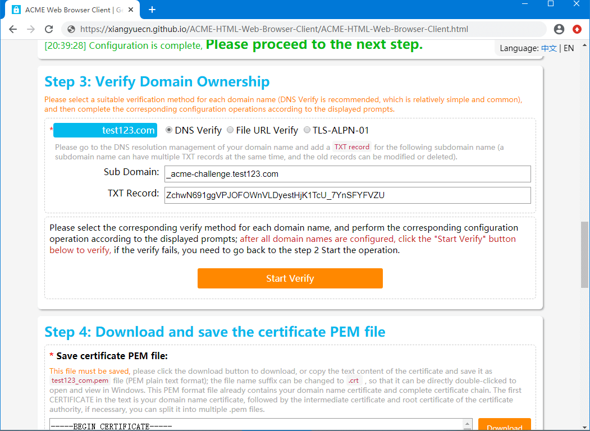

[GitHub](https://github.com/xiangyuecn/ACME-HTML-Web-Browser-Client) | [Gitee](https://gitee.com/xiangyuecn/ACME-HTML-Web-Browser-Client) | License: [GPL-3.0](LICENSE)

# HTML5网页版ACME客户端 | ACME Web Browser Client

**本网页客户端（仅一个静态HTML网页文件）用于**：向 [Let's Encrypt](https://letsencrypt.org/)、[ZeroSSL](https://zerossl.com/)、[Google](https://pki.goog/) 等支持 ACME 协议的证书颁发机构，免费申请获得用于 HTTPS 的 SSL/TLS 域名证书（`RSA`、`ECC/ECDSA`），支持多域名和通配符泛域名；只需在现代浏览器上操作即可获得 PEM 格式纯文本的域名证书，不依赖操作系统环境（Windows、macOS都能用），无需下载和安装软件，无需注册登录，纯手动操作，**只专注于申请获得证书这一件事，简单易用，非常适用于希望手动快捷申请获得证书的使用场景**。

**在线使用网址(GitHub)：** [https://xiangyuecn.github.io/ACME-HTML-Web-Browser-Client/ACME-HTML-Web-Browser-Client.html](https://xiangyuecn.github.io/ACME-HTML-Web-Browser-Client/ACME-HTML-Web-Browser-Client.html)

**交流与支持：欢迎加QQ群 `421882406`，纯小写口令 `xiangyuecn`。如需功能定制，网站、App、小程序、前端和后端等开发需求，请加此QQ群，联系群主（即作者），谢谢~**

[​](?)

**This web client (only a single static HTML web page file) is used to**: apply for free SSL/TLS domain name certificates (`RSA`, `ECC/ECDSA`) for HTTPS from Let's Encrypt , ZeroSSL , Google and other certificate authorities that support the ACME protocol, and support multiple domain names and wildcard pan-domain names; Simply operate on a modern browser to obtain a domain name certificate in plain text in PEM format, does not depend on the operating system environment (both Windows and macOS can be used), does not need to download and install software, does not need to register and log in, and is purely manual, **only focus on the only thing that is to apply for and obtain a certificate, which is simple and easy to use, It is very suitable for scenarios where you want to apply for certificates manually and quickly**.

**Online website (GitHub):** [https://xiangyuecn.github.io/ACME-HTML-Web-Browser-Client/ACME-HTML-Web-Browser-Client.html](https://xiangyuecn.github.io/ACME-HTML-Web-Browser-Client/ACME-HTML-Web-Browser-Client.html)

**Communication and support: Welcome to join the QQ group `421882406` , code `xiangyuecn` . If you need function customization, website, app, applet, front-end and back-end development needs, please join this QQ group and contact the group owner (ie the author), thank you~**

[​](?)

[​](?)

[​](?)

## 特性 | Features

- `超级兼容`：不限操作系统、无需考虑运行环境，只需用你常用的浏览器打开网页即可申请证书。
- `功能丰富`：支持申请`RSA`或`ECC(ECDSA)`证书，支持多域名和通配符，支持多个证书颁发机构。
- `简单易用`：点点鼠标 Ctrl+C Ctrl+V 就能完成证书的申请，全程需要的操作少，每一步都有保姆级操作提示，UI友好大气美观；**本客户端不需要注册账号、更不需要登录**。
- `单一文件`：本网页客户端仅一个静态 HTML 文件，不依赖其他任何文件；因此可以直接保存到你本地，即可通过浏览器打开。
- `数据安全`：除了你指定证书颁发机构的 ACME 接口地址外，本网页客户端不会向其他任何地址发送数据，通过浏览器控制台很容易做到网络数据审查。
- `系统安全`：纯网页应用，不会也无法对你的电脑系统做出任何修改。

[​](?)

- `Super Compatibility`: No operating system restrictions, no need to consider the operating environment, just use your common browser to open the web page to apply for a certificate.
- `Rich functions`: Support to apply for `RSA` or `ECC(ECDSA)` certificate, support multiple domain names and wildcards, and support multiple certificate authorities.
- `Easy to use`: Click the mouse and Ctrl+C Ctrl+V to complete the certificate application. The whole process requires less operations, and there are nanny level operation prompts at each step; UI friendly, atmospheric and beautiful; **This client does not need to register an account, and does not need to log in**.
- `A single file`: This web client is only a single static HTML web page file and does not depend on any other files; therefore, it can be directly saved to your local, and you can open it through a browser.
- `Data security`: Except for the ACME interface address of the certificate authority you specify, this web client will not send data to any other address, and it is easy to check the network data through the browser console.
- `System security`: Pure web application, will not and cannot make any modification to your computer system.

[​](?)

> **Certificate Expiration Risk Alert**: Since this web client can only be operated manually and does not support automatic renewal, you should pay attention to apply for a new certificate before the certificate expires (free certificates are generally valid for 90 days, you only need to repeat the operation at that time), or use acme.sh and other client automatic renewal.
> 
> **证书过期风险提醒**：由于本网页客户端只能纯手动操作，不支持自动续期，需注意在证书过期前重新生申请新证书（免费证书普遍90天有效期，届时只需重复操作一遍即可），或使用 acme.sh 等客户端自动化续期。

[​](?)

[​](?)

[​](?)

## 使用方法 | Usage

1. **打开本网页客户端**：可以直接双击打开保存在本地的HTML文件，或者直接打开[在线网页](https://xiangyuecn.github.io/ACME-HTML-Web-Browser-Client/ACME-HTML-Web-Browser-Client.html)使用;
2. **步骤一**：在网页内选择证书颁发机构，或填写支持的ACME服务地址；不同证书颁发机构需要的操作不一定相同，请根据提示进行操作；
3. **步骤二**：在网页内填写需要申请证书的域名（支持多域名、通配符），和密钥等信息配置；不同证书颁发机构需要填写的配置不一定相同，请根据提示进行操作；
4. **步骤三**：根据网页内显示的第三步内容，给每个域名配置好合适的域名所有权验证方式；常见的验证方式有：DNS解析中配置TXT记录进行验证、上传文件到服务器进行验证，通配符域名一般仅支持DNS验证；等全部配置完成后开始验证；
5. **步骤四**：等域名所有权验证通过后，网页会显示第四步，提供证书文件下载，下载保存好；
6. **最后**：将下载保存的证书和私钥配置到你的网站中即可，不同系统程序的配置方法不同，请自行查找对应配置方法。

[​](?)

1. **Open this webpage client**: you can directly double-click to open the HTML file saved locally, or directly open the [online webpage](https://xiangyuecn.github.io/ACME-HTML-Web-Browser-Client/ACME-HTML-Web-Browser-Client.html) for use;
2. **Step 1**: Select a certificate authority in the webpage, or fill in the supported ACME service address; the operations required by different certificate authorities may not be the same, please operate according to the prompts;
3. **Step 2**: Fill in the domain name (multiple domain names and wildcards are supported) to apply for a certificate, and the configuration of the key and other information in the webpage; the configuration that needs to be filled in by different certificate authorities may not be the same, please operate according to the prompts;
4. **Step 3**: Configure an appropriate domain name ownership verification method for each domain name according to the third step content displayed on the webpage; common verification methods include: configuring TXT records in DNS resolution for verification, uploading files to the server for verification; wildcard domain names Generally, only DNS verification is supported; the verification starts after all configurations are completed;
5. **Step 4**: After the domain name ownership verification is passed, the web page will display the step 4, provide the certificate file to download, download and save it;
6. **Finally**: configure the downloaded and saved certificate and private key to your website. The configuration methods of different system programs are different, please find the corresponding configuration method by yourself.

[​](?)

## 使用截图 | Use Screenshots

[​](?)

[​](?)

[​](?)

## 部分原理 | Some Principles
得益于现代浏览器的 [crypto.subtle](https://developer.mozilla.org/en-US/docs/Web/API/SubtleCrypto) 对加密功能标准化，不依赖其他任何js库就能在网页上实现 `RSA`、`ECC` 的加密、解密、签名、验证、和密钥对生成。在本客户端内的 `X509` 对象中：用 X509.CreateCSR 来生成CSR，用 X509.KeyGenerate 来创建PEM格式密钥，用 X509.KeyParse 来解析PEM格式密钥，用 X509.KeyExport 来导出PEM格式密钥；这些功能都是根据相应的标准用js代码在二进制层面上实现的，二进制数据操作封装在了 `ASN1` 对象中：实现了 ASN.1 标准的二进制解析和封包，使用 ASN1.ParsePEM 方法可以解析任意的PEM格式密钥或证书。以上这些都是实现ACME网页客户端的核心基础。

然后就是对接ACME实现证书的签发，和实现交互UI；对接ACME可以直接参考 RFC 8555 标准。有些证书颁发机构的ACME服务对浏览器支持不良，未提供齐全的 `Access-Control-*` 响应头，导致网页内无法直接调用服务接口；目前采用的解决办法非常简单粗暴，比如ZeroSSL：检测到此ACME服务存在跨域问题时，会调用 `acmeReadDirGotoCORS()` 方法告诉用户操作步骤（你可以手动调用此方法），通过在他们的页面内运行本客户端来消除跨域问题（既然打不过，那就加入他们）。

[​](?)

Thanks to the standardization of encryption functions by crypto.subtle of modern browsers, `RSA` and `ECC` encryption, decryption, signature, verification, and key pair generation can be implemented on web pages without relying on any other js library. In the `X509` object in this client: use X509.CreateCSR to generate CSR, use X509.KeyGenerate to create PEM format key, use X509.KeyParse to parse PEM format key, use X509.KeyExport to export PEM format key; These functions are implemented at the binary level with js code according to the corresponding standards, and binary data operations are encapsulated in `ASN1` objects: ASN.1 standard binary parsing and encapsulation are implemented, Arbitrary PEM format keys or certificates can be parsed using the ASN1.ParsePEM method. These are the core foundations for implementing the ACME web client.

Then it is to connect with ACME to realize certificate issuance and realize interactive UI; for connecting with ACME, you can directly refer to the RFC 8555 standard. The ACME services of some certificate authorities do not support browsers well, and do not provide complete `Access-Control-*` response headers, so that the service interface cannot be called directly in the web page; the current solution is very simple and rude, such as ZeroSSL: detect this ACME When there is a cross-domain problem with the service, the `acmeReadDirGotoCORS()` method will be called to tell the user the operation steps (you can call this method manually), and the cross-domain problem will be eliminated by running this client in their page (if we can't beat them, we'd better join them).

[​](?)

[​](?)

[​](?)

## 为什么会这么丑 | Why is it so ugly
README和HTML的中英对照翻译主要来自：Chrome自带翻译+百度翻译，由中文翻译成English（作者英文很菜）。另外为什么没有拆分成每个语言一个文件，非要混乱的搞在一起：作者头已秃，文件多了怕心智负担太重 :) 。

如果你不需要自动化续期，只想手动申请获得证书，使用本网页版的客户端是一个很不错的选择。

可能正是因为手动操作、且不支持自动续期的原因，`Let's Encrypt`官网的ACME客户端列表中特别的不提供浏览器版的客户端；导致对于仅想获得证书，并不需要自动化功能的用户，不得不小心翼翼的使用那些不容易使用的客户端。

之前我一直通过 `diafygi/gethttpsforfree` 网页来申请证书，但操作太复杂了，从官网中又找不到更好的网页客户端，所以我就自己写代码做了一个，欢迎使用。

[​](?)

The Chinese-English translation of README and HTML mainly comes from: Chrome comes with translation + Baidu translation, which is translated from Chinese to English (the author's English level is very low). In addition, why is it not split into one file for each language, and it has to be cluttered together: the author's head is bald, and there are too many files for fear that the mental burden will be too heavy :) .

If you don't need automatic renewal and just want to apply for a certificate manually, using this web page client is a good choice.

It may be because of manual operation and the fact that automatic renewal is not supported. The ACME client list on the `Let's Encrypt` official website does not provide a browser version of the client. As a result, users who only want to obtain certificates and do not need automation functions, they can only choose to use those clients that are not easy to use.

I have been applying for a certificate through the `diafygi/gethttpsforfree` webpage before, but the operation was too complicated, and I couldn't find a better web client from the official website, so I wrote my own code and made one, welcome to use.

[​](?)

[​](?)

[​](?)

## 捐赠 | Donate
如果这个项目有帮助到您，欢迎 Star 一下方便以后找得到。

If this project is helpful to you, welcome Star, it will be convenient to find it in the future.

您也可以使用支付宝或微信打赏作者：

  

